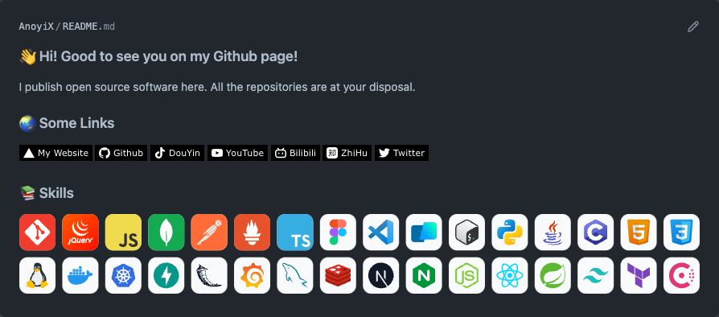

# ✨ Features

- [✨ Features](#-features)
- [🧑‍💻 Example](#-example)
- [🧪 Customization](#-customization)
  - [icons](#icons)
  - [cols](#cols)
  - [iconBgColor](#iconbgcolor)
- [🎉 Icons List](#-icons-list)
- [🎨 Figma Resource](#-figma-resource)

# 🧑‍💻 Example



# 🧪 Customization

## icons

Merge multiple icons in one svg

```md

```

[](https://anoyi.com/dev-icons)


## cols

`Optional`, default value is `16`, 

Change the `&cols=3` to any number between 1 and 50.

```md

```

[](https://anoyi.com/dev-icons)

## iconBgColor

`Optional`, default value is `null`, 

Change the `&iconBgColor=F3F4F6` to fill a rect to each icon.

```md


```

[](https://anoyi.com/dev-icons)

[](https://anoyi.com/dev-icons)

# 🎉 Icons List

Please visite [https://anoyi.com/dev-icons](https://anoyi.com/dev-icons) to see all icons with names.


# 🎨 Figma Resource

See all icons in [Figma](https://www.figma.com/file/9MzhQygAIiTlJj79UbpBHK/DevIcons).